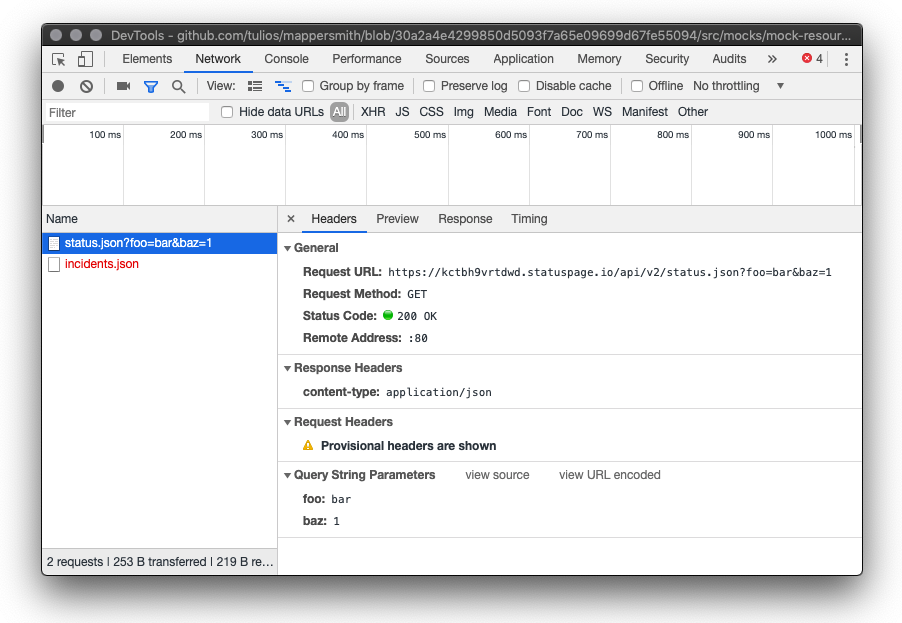

# [mappersmith-recorder](https://npmjs.org/packages/mappersmith-recorder)

> **EXPERIMENTAL**: This module is in a very early stage and intended to be used in a very specific context. It may or may not be appropriate for your use case. For something more mature and generic, take a look at [PollyJS](https://netflix.github.io/pollyjs/#/).

[Mappersmith](https://github.com/tulios/mappersmith) middleware to record requests and responses as [HAR](http://www.softwareishard.com/blog/har-12-spec/) files. These files are simple JSON files that can either be read directly or loaded into a HAR viewer or even the browser's own developer tools.

> Note that this middleware currently only works in NodeJS, as it relies on being able to write files to the filesystem. You can implement a custom persistence class that works in a browser environment, but it does not come out of the box.



## Installation

```sh
$ yarn add mappersmith-recorder
```

## Usage

```javascript
const path = require('path')
const forge = require('mappersmith');
const { RecorderMiddleware, Session, FileSystemPersistence } = require('mappersmith-recorder');

const persistence = new FileSystemPersistence({ path: path.join(__dirname, 'recordings') })
const session = new Session({ name: 'github', persistence })

const client = forge({
  clientId: 'github',
  middleware: [RecorderMiddleware({ session })],
  host: 'https://status.github.com',
  resources: {
    Status: {
      current: { path: '/api/status.json' }
    }
  }
});

const main = async () => {
    await client.Status.current()

    // Save the session to disk
    await session.save()

    await client.Status.current()

    // Save session containing both calls
    await session.save()

    // Clear the session
    session.reset()
}

main()
```

After running the following, in `recordings/` there should be two files called `github-${datetime}.har`.